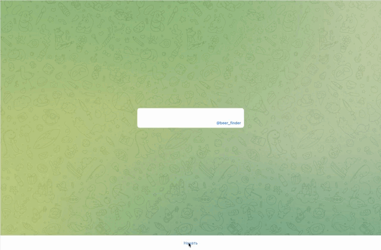
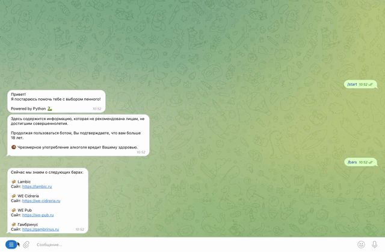
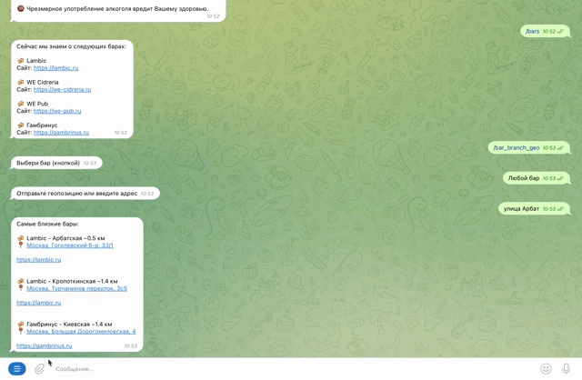

[](https://github.com/pre-commit/pre-commit)
[](http://mypy-lang.org/)
[](https://github.com/psf/black)
<h1 align="center">Beer Finder</h1>

### Description:
The Django project with monolithic architecture aims to parse data of beer 
from Moscow bars and store it in a PostgreSQL database. 
The application is built using the Django web framework, with Django Rest Framework 
(DRF) for exposing the data via RESTful APIs, and Python-telegram-bot for providing 
data to users through a Telegram bot. Application statistics are collected in MongoDB.
The functionality of the bot also includes the use of the user's geolocation 
to plot a route to a suitable bar.

### [Bot](https://t.me/BeersFinder_bot) preview in few steps:
* As a user, you can see the list of available bars:

* As a user, you can choose the nearest bar by sending the geolocation to the bot
or simply typing your address:

* As a user, you can get bar coordinates based on metro station:

* As a user, you can find beer based on the available filters or your preferences:


### Installation:
* Clone the repository to a local directory:
  ```sh
  https://github.com/bycs/beer_finder
  ```
* Set your own variable values in ```.env_template``` and rename to ```.env```
* Application launch:
```sh
  docker-compose -f docker-compose.prod.yaml up --build
  ```
>For development:
> > docker-compose -f docker-compose.dev.yaml up --build

### API specification:
>Swagger UI:
> >http://79.137.198.62/api/v1/docs/

| Router                          | Description                           |
|:--------------------------------|:--------------------------------------|
| GET/api/v1/bar_branches/        | Returns bar branches data             |
| GET/api/v1/bar_branches/{uuid}/ | Returns current bar branch data by pk |
| GET/api/v1/bars/                | Returns bars data                     |
| GET/api/v1/bars/{uuid}/         | Returns current bar data by pk        |
| GET/api/v1/beers/               | Returns beer data                     |
| GET/api/v1/beers/{uuid}/        | Returns current beer data by pk       |

### Join the development:
* Repeat the first two steps from the ```Installation```
* Activate the virtual environment:
```sh
poetry config virtualenvs.in-project true
poetry install
  ```
* Use pre-commit:
```sh
pre-commit install
  ```

### Do you have any questions?
Contact me on [Telegram](https://t.me/DD506)
